# Abu Huraira Ahmed

<p align="center">
  
</p>

<p align="center">
  
</p>

<p align="center">
  
  
  
  
</p>

## About Me

I’m **Abu Huraira Ahmed**, a Flutter Developer from Pakistan focused on polished mobile apps, clean UI systems, and pragmatic Firebase workflows.

## System Information

```text
Name ............... Abu Huraira Ahmed
Role ............... Flutter Developer
GitHub ............. Abuhuraira-create
Location ........... Pakistan
Status ............. Building • Learning • Shipping
Languages .......... Dart
Framework .......... Flutter
Toolchain .......... VS Code • Git • Android Studio • Figma
Current Focus ...... Mobile Apps • Clean Code • UX
Currently .......... Crafting scalable & delightful apps
```

## Tech Stack

<p align="center">
  
  
  
  
  
  
  
  
</p>

## Dashboard

<table>
  <tr>
    <td width="33%">
      
    </td>
    <td width="33%">
      
    </td>
    <td width="33%">
      
    </td>
  </tr>
  <tr>
    <td colspan="2">
      
    </td>
    <td>
      <p align="center">
        
        
        
        
      </p>
      <p align="center">
        
        
        
        
      </p>
    </td>
  </tr>
</table>

## Featured Projects

<table>
  <tr>
    <td width="50%">
      <h3>SpendViz</h3>
      <p>Personal finance dashboard for tracking spending patterns and budget clarity.</p>
      <p><strong>Tech Stack:</strong> Flutter, Firebase, charts, local persistence</p>
      <p><strong>Status:</strong> </p>
    </td>
    <td width="50%">
      <h3>PV Mohalla</h3>
      <p>Community-first mobile experience for neighborhood updates and coordination.</p>
      <p><strong>Tech Stack:</strong> Flutter, Firebase, notifications, maps</p>
      <p><strong>Status:</strong> </p>
    </td>
  </tr>
  <tr>
    <td width="50%">
      <h3>Receipt OCR</h3>
      <p>Capture receipts, extract structured data, and turn paper trails into records.</p>
      <p><strong>Tech Stack:</strong> Flutter, OCR pipeline, cloud functions, Firebase</p>
      <p><strong>Status:</strong> </p>
    </td>
    <td width="50%">
      <h3>AI Automation</h3>
      <p>Workflow automation layer for repetitive product tasks and assistance.</p>
      <p><strong>Tech Stack:</strong> Flutter, APIs, webhooks, cloud workflows</p>
      <p><strong>Status:</strong> </p>
    </td>
  </tr>
</table>

## Current Focus

- Mobile app polish and motion
- Firebase architecture and security rules
- Clean component reuse
- Release-ready build automation

## Visitor Counter

<p align="center">
  
</p>

## Setup

For build, customization, and deployment details, see:

- [`docs/setup.md`](./docs/setup.md)
- [`docs/customization.md`](./docs/customization.md)

## Footer

Built to feel like a premium terminal, not a generic template.
